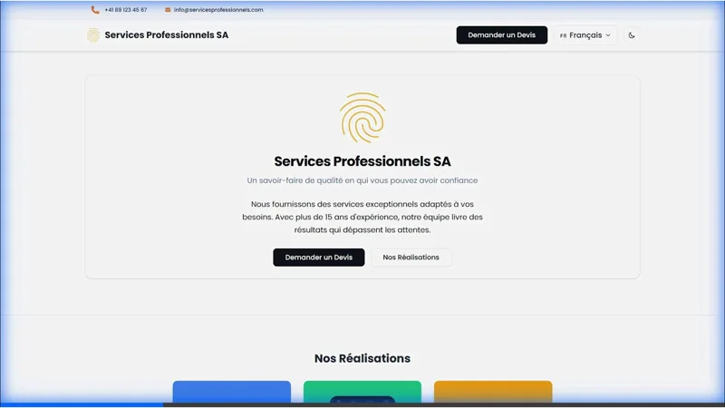

import { Steps, Aside, Card, CardGrid } from '@astrojs/starlight/components';

**Goal:** Get your multilingual site running locally in 10 minutes.

:::note[Prerequisites]
- **Node.js 18+** installed on your system
- **Basic Astro knowledge** - [Learn Astro fundamentals](https://docs.astro.build)
:::

Welcome! Let's get your site running and customized in about 10 minutes.

<Aside type="note" title="About This Documentation">
  This documentation covers the **Astro Swiss Theme** (paid version with all features). The free starter theme is available on GitHub with core features. Installation instructions work for both versions.
</Aside>

## Install & Run <sup>2 minutes</sup>

<Steps>

1. **Clone the repository**

   ```bash
   # Free starter theme (public repository)
   git clone https://github.com/vincentheimann/astro-swiss-free-starter-theme.git
   cd astro-swiss-free-starter-theme
   ```

2. **Install dependencies**

   ```bash
   npm install
   ```

3. **Start the dev server**

   ```bash
   npm run dev
   ```

</Steps>

✅ **Success!** Open [http://localhost:4321](http://localhost:4321) in your browser. You should see:


<Aside type="tip" title="Try dark mode!">
  Click the theme toggle in the header to see your site in dark mode.
  
  
</Aside>

---

## Make It Yours <sup>8 minutes</sup>

### 1. Update Your Company Info <sup>3 minutes</sup>

Open `src/consts.ts` and update:

```typescript title="src/consts.ts"
export const COMPANY: CompanyInfo = {
    name: "Your Company Name",           // ← Change this
    address: "Your Street Address",      // ← And this
    city: "CH-1000 Your City",          // ← And this
    phone: "+41 XX XXX XX XX",          // ← Your phone
    email: "contact@yourcompany.com",   // ← Your email
    // ... rest stays the same for now
};
```

Save and watch your browser update instantly! ⚡

### 2. Change Your Brand Colors <sup>2 minutes</sup>

Open `src/styles/tokens.css` and update the accent color:

```css title="src/styles/tokens.css"
:root {
  --accent: #3b82f6;  /* Change to your brand color */
}
```

Try it! The theme will update immediately with your brand color.

### 3. Update Site Name & Description <sup>3 minutes</sup>

Open `src/i18n/ui.ts` and find the `fr:` section (French):

```typescript title="src/i18n/ui.ts" {2-5}
fr: {
  'business.name': 'Your Company Name',
  'business.tagline': 'Your tagline here',
  'site.title': 'Your Site Title',
  'site.description': 'Your site description for SEO',
  // ... more below
}
```

Do the same for the `de:` section (German) if you're using both languages.

---

## What You Just Built

You now have a **multilingual website** with:

- 🌍 French & German language support
- 🌓 Automatic dark/light mode
- 📱 Mobile-responsive design
- ⚡ Blazing-fast performance

<Aside type="note">
  The dev server automatically reloads when you make changes. Keep it running while you customize!
</Aside>

---

## Next Steps - Pick Your Path

<CardGrid>

<Card title="Add Your Team" icon="star">

Want to add employees?

**[Data Management Guide →](/guides/data-management/#adding-an-employee)**

</Card>

<Card title="Add Your Work" icon="seti:image">

Want to showcase projects?

**[Data Management Guide →](/guides/data-management/#adding-a-portfolio-project)**

</Card>

<Card title="Customize Design" icon="pencil">

Want to change colors, fonts, or styling?

**[Styling Guide →](/guides/styling/)**

</Card>

<Card title="Add More Languages" icon="translate">

Want to support more languages?

**[Adding Languages →](/guides/adding-languages/)**

</Card>

<Card title="Deploy Your Site" icon="rocket">

Ready to go live?

**[Deployment Guide →](/deployment/)**

</Card>

<Card title="Need Help?" icon="information">

Questions or issues?

**[Support & FAQ →](/reference/support/)**

</Card>

</CardGrid>

---

<Aside type="tip" title="Pro tip">
  Keep the dev server running (`npm run dev`) while you make changes. Everything updates automatically!
</Aside>
