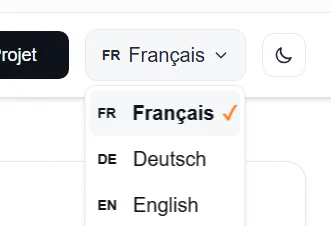

import { Aside, Steps, Card, CardGrid } from '@astrojs/starlight/components';

**Goal:** Add Italian support in 4 steps (~15 minutes).

Both themes ship **French, German and English** out of the box. This guide adds a fourth language — Italian — and the same steps work for any other language.



## Complete Example: Adding Italian

<Steps>

1. **Update `src/i18n/ui.ts`**
   
   Add the language to the `languages` object:
   
   ```typescript title="src/i18n/ui.ts" ins={5}
   export const languages = {
     fr: { name: 'Français', flag: '🇫🇷' },
     de: { name: 'Deutsch', flag: '🇩🇪' },
     en: { name: 'English', flag: '🇬🇧' },
     it: { name: 'Italiano', flag: '🇮🇹' },
   } as const;
   ```
   
   Add all translations to the `ui` object:
   
   ```typescript title="src/i18n/ui.ts"  ins={5-19}
   export const ui = {
     fr: { /* French translations */ },
     de: { /* German translations */ },
     en: { /* English translations */ },
     it: {
       'nav.home': 'Home',
       'nav.work': 'I nostri lavori',
       'nav.about': 'Informazioni',
       'nav.contact': 'Contattaci',
       'business.name': 'La tua azienda',
       'business.tagline': 'Il tagline della tua azienda',
       'site.title': 'Titolo del tuo sito',
       'site.description': 'Descrizione del tuo sito per SEO',
       'author.name': 'Tu Numero',
       'author.email': 'tu@email.com',
       'theme.toggle': 'Cambia argomento',
       // ... copy all other keys from FR, DE or EN
     },
   } as const;
   ```
   
   :::tip[Translation Tip]
   Copy all keys from the `fr`, `de` or `en` section to ensure you have complete translations.
   :::

2. **Update `astro.config.mjs`**
   
   Add the locale to the Astro configuration:
   
   ```javascript title="astro.config.mjs" ins={3}
   i18n: {
     defaultLocale: "fr",
     locales: ["fr", "de", "en", "it"],
     routing: {
       prefixDefaultLocale: false,
     },
   },
   ```

3. **Create Page Folder**
   
   Create `src/pages/it/index.astro`:
   
   ```astro title="src/pages/it/index.astro"
   ---
   import BaseLayout from "../../layouts/BaseLayout.astro";
   import Header from "../../components/Header.astro";
   import Landing from "../../components/Landing.astro";
   ---
   
   <BaseLayout>
     <Header />
     <Landing />
   </BaseLayout>
   ```

4. **Test**
   
   Start your dev server and visit:
   ```
   http://localhost:4321/it/
   ```
   
   ✅ **Success indicators:**
   - Italian appears in the language selector
   - Italian-speaking browsers auto-redirect to `/it/`
   - HTML has `lang="it"` attribute
   - All content displays in Italian

</Steps>

---

## How It Works

### Dynamic Language Detection in BaseLayout

The `BaseLayout.astro` checks if the current locale exists in the `languages` object:

```typescript
const lang: Language = (currentLocale && currentLocale in languages) 
  ? currentLocale as Language 
  : defaultLang;
```

**No hardcoded checks!** If you add a language to `ui.ts`, it's automatically supported.

### First-Visit Detection on the Homepage

The default-locale homepage (`src/pages/index.astro`) ships a small inline script that redirects first-time visitors based on `navigator.language`. Its list of valid locales is derived from the `languages` object, and an explicit choice made in the language selector (stored in `localStorage`) is never overridden:

```typescript
var stored = localStorage.getItem("lang");
var lang = stored || (navigator.language || "").split("-")[0].toLowerCase();
if (lang && lang !== defaultLang && locales.indexOf(lang) !== -1) {
  location.replace("/" + lang + "/");
}
```

**Fully scalable** - Any language you add will be auto-detected from the browser, on any static host.

### Language Selector

The `LanguageSelector.astro` imports from `ui.ts`:

```typescript
import { languages } from "@/i18n/ui";
```

It automatically displays all available languages with their flags.

---

## Translation Tips

### Copy an Existing Language

The easiest way is to:

<Steps>

1. Copy the French, German or English section from `ui.ts`
2. Paste it as your new language
3. Translate each value

</Steps>

### Required Translation Keys

Make sure to include all these keys (copy from existing languages):

- Navigation: `nav.*`
- Business: `business.*`
- Portfolio: `portfolio.*`
- Owner: `owner.*`
- Contact: `contact.*`
- Site metadata: `site.*`
- Author: `author.*`

### Keep Author Info Consistent

Some values like `author.email` and `author.phone` should be the same across all languages (unless you have different contact info per region).

---

## Folder Structure

```
src/
├── i18n/
│   ├── ui.ts          ← Add language here (Step 1)
│   └── utils.ts       ← No changes needed (dynamic)
├── layouts/
│   └── BaseLayout.astro  ← No changes needed (dynamic)
├── pages/
│   ├── index.astro    ← French (default) + first-visit detection script (dynamic)
│   ├── de/
│   │   └── index.astro
│   ├── en/
│   │   └── index.astro
│   └── it/            ← Create this (Step 3)
│       └── index.astro
└── astro.config.mjs   ← Add locale (Step 2)
```

---

## Example: Adding Spanish

```typescript title="src/i18n/ui.ts" ins={6, 19-25}
// 1. src/i18n/ui.ts
export const languages = {
  fr: { name: 'Français', flag: '🇫🇷' },
  de: { name: 'Deutsch', flag: '🇩🇪' },
  en: { name: 'English', flag: '🇬🇧' },
  es: { name: 'Español', flag: '🇪🇸' },
} as const;

export const ui = {
  fr: {
    // ... French translations
  },
  de: {
    // ... German translations
  },
  en: {
    // ... English translations
  },
  es: {
    'nav.home': 'Inicio',
    'nav.work': 'Nuestros Trabajos',
    'nav.about': 'Acerca de',
    'nav.contact': 'Contacto',
    // ... rest of translations
  },
} as const;
```

```javascript title="astro.config.mjs" ins={2}
// 2. astro.config.mjs
locales: ["fr", "de", "en", "es"],
```

```
3. Create: src/pages/es/index.astro
4. Test at: http://localhost:4321/es/
```

---

## Troubleshooting

### Language not appearing in selector?

Check that it's added to the `languages` object in `ui.ts` with the `as const` modifier.

### Dropdown shows but page doesn't translate?

Verify all translation keys exist in the `ui` object for that language.

### Browser not auto-redirecting?

Detection runs client-side on the first visit and respects a language stored in `localStorage` (key `lang`). Clear that key or test in incognito — a previous explicit choice in the language selector is never overridden.

### TypeScript errors?

Make sure you have the `as const` on both the `languages` and `ui` objects in `ui.ts`.

---

## Next Steps

<CardGrid>
  <Card title="Configuration" icon="setting">
    Learn more about i18n configuration.
    
  [Configuration Guide →](/guides/configuration/)
  </Card>
  
  <Card title="Customization" icon="pencil">
    Customize content and components.
    
  [Customization Guide →](/guides/customization/)
  </Card>
  
  <Card title="Styling" icon="palette">
    Style your multilingual site.
    
  [Styling Guide →](/guides/styling/)
  </Card>
</CardGrid>
