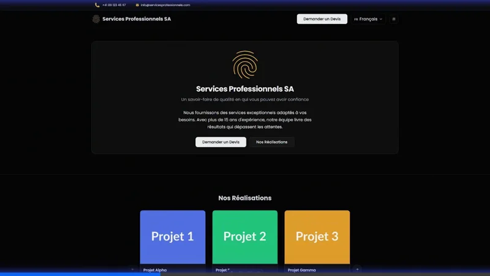

import { Aside, Steps, Card, CardGrid } from '@astrojs/starlight/components';

Learn how to add team members, portfolio projects, and manage your site's content.

## Quick Start

- **Add an employee?** → [Jump to Adding an Employee](#adding-an-employee)
- **Add a portfolio project?** → [Jump to Adding a Portfolio Project](#adding-a-portfolio-project)

---

## Adding an Employee

Employees are displayed in the **Team Section** using the `EmployeeSection.astro` component.

### Step 1: Add Employee Data

**File:** `src/consts.ts`

Add a new employee entry to the `EMPLOYEES` object:

```typescript title="src/consts.ts"
export const EMPLOYEES: Record<string, EmployeeInfo> = {
    // ... existing employees ...
    
    // Add your new employee
    ABC: {  // Use a 3-letter trigram (e.g., initials)
        id: "ABC",
        name: "Anna Brown Carter",
        portrait: "/images/employees/anna-brown.jpg", // Optional
        email: "anna.brown@yourcompany.com",
        phone: "+41 89 123 45 70",
        socials: {
            linkedin: "https://www.linkedin.com/in/annabrown/",
            facebook: "",  // Leave empty if not used
            instagram: "",
            twitter: "",
            github: "https://github.com/annabrown/",
        },
    },
};
```

<Aside type="note" title="ID (Trigram)">
  Use a unique 3-letter code (usually initials). This is used as a key for translations.
</Aside>

<Aside type="tip" title="Portrait">
  Optional. If empty, an auto-generated avatar will be used based on the employee's name.
</Aside>

### Step 2: Add Employee Translations

**File:** `src/i18n/ui.ts`

Add translations for the employee's title and bio in **all languages**:

```typescript title="src/i18n/ui.ts"
export const ui = {
    fr: {
        // ... existing translations ...
        
        // Add employee translations (French)
        'employee.ABC.title': 'Directrice Marketing',
        'employee.ABC.bio': 'Anna dirige notre stratégie marketing avec créativité et innovation.',
    },
    de: {
        // ... existing translations ...
        
        // Add employee translations (German)
        'employee.ABC.title': 'Marketing Direktorin',
        'employee.ABC.bio': 'Anna leitet unsere Marketingstrategie mit Kreativität und Innovation.',
    },
} as const;
```

**Translation Keys Format:**
- Title: `employee.{ID}.title`
- Bio: `employee.{ID}.bio`

### Step 3: Add Portrait Image (Optional)

If you have a portrait image:

<Steps>

1. Add the image to `public/images/employees/`
2. Reference it in `consts.ts` as shown above
3. Recommended size: 240x240px or larger (square)

</Steps>

If you leave the `portrait` field empty, the component will automatically generate an avatar using the employee's name.

### Step 4: Verify

1. Save all files
2. The employee will automatically appear in the Team section
3. Check both language versions to ensure translations are correct

---

## Adding a Portfolio Project

Portfolio projects are displayed in the **Portfolio Section** with an interactive carousel and lightbox.



### Step 1: Prepare Your Project Image

**Option A: Use a local image**
1. Add your image to `src/assets/portfolio/`
2. Recommended size: 800x600px or similar aspect ratio
3. Supported formats: JPG, PNG, WebP

**Option B: Use an external URL**
- You can use any image URL (e.g., placeholder services, CDN)

### Step 2: Add Project to French Portfolio

**File:** `src/data/portfolio/fr.ts`

```typescript title="src/data/portfolio/fr.ts"
import { nanoid } from "nanoid";
import type { ImageMetadata } from "astro";

// If using local image, import it:
import myProjectImage from "../../assets/portfolio/my-project.jpg";

export const portfolioFr: PortfolioProject[] = [
    // ... existing projects ...
    
    // Add your new project
    {
        id: nanoid(),  // Auto-generates unique ID
        title: "Mon Nouveau Projet",
        description: "Description détaillée du projet en français.\n\nVous pouvez utiliser plusieurs lignes.",
        image: myProjectImage,  // Use imported image
        // OR use external URL:
        // image: "https://example.com/image.jpg",
        
        // Optional: Call-to-action buttons
        primaryCtaText: "Voir le projet →",
        primaryCtaLink: "https://example.com/project",
        secondaryCtaText: "En savoir plus",
        secondaryCtaLink: "https://example.com/about",
    },
];
```

### Step 3: Add Project to German Portfolio

**File:** `src/data/portfolio/de.ts`

Add the **same project** with German translations:

```typescript title="src/data/portfolio/de.ts"
import { nanoid } from "nanoid";
import myProjectImage from "../../assets/portfolio/my-project.jpg";

export const portfolioDe: PortfolioProject[] = [
    // ... existing projects ...
    
    {
        id: nanoid(),  // Different ID is OK
        title: "Mein Neues Projekt",
        description: "Detaillierte Projektbeschreibung auf Deutsch.\n\nSie können mehrere Zeilen verwenden.",
        image: myProjectImage,  // Same image
        primaryCtaText: "Projekt ansehen →",
        primaryCtaLink: "https://example.com/project",
        secondaryCtaText: "Mehr erfahren",
        secondaryCtaLink: "https://example.com/about",
    },
];
```

### Project Properties Explained

| Property | Required | Description |
|----------|----------|-------------|
| `id` | ✅ Yes | Unique identifier (use `nanoid()`) |
| `title` | ✅ Yes | Project title |
| `description` | ✅ Yes | Project description (supports multi-line with `\n`) |
| `image` | ✅ Yes | Imported image or URL string |
| `primaryCtaText` | ❌ No | Text for primary button |
| `primaryCtaLink` | ❌ No | URL for primary button |
| `secondaryCtaText` | ❌ No | Text for secondary button |
| `secondaryCtaLink` | ❌ No | URL for secondary button |

### Step 4: Verify

1. Save all files
2. The project will automatically appear in the portfolio carousel
3. Test the lightbox by clicking on the project image
4. Verify both language versions

---

## Updating Company Information

Company information is centralized in `src/consts.ts`.

### Edit Company Details

```typescript title="src/consts.ts"
export const COMPANY: CompanyInfo = {
    name: "Your Company Name",
    address: "Your Street Address",
    pobox: "P.O. Box 123",  // Leave empty if not used
    city: "CH-1000 Your City",
    phone: "+41 XX XXX XX XX",
    email: "contact@yourcompany.com",
    mapsUrl: "https://maps.google.com/?q=Your+Address",
    socials: {
        linkedin: "https://www.linkedin.com/company/yourcompany/",
        facebook: "https://facebook.com/yourcompany",
        instagram: "https://instagram.com/yourcompany",
        twitter: "https://twitter.com/yourcompany",
        github: "https://github.com/yourcompany",
    },
};
```

### Update Company Translations

**File:** `src/i18n/ui.ts`

Update translatable company information:

```typescript title="src/i18n/ui.ts"
export const ui = {
    fr: {
        'business.name': 'Votre Entreprise',
        'business.tagline': 'Votre slogan ici',
        'business.description': 'Description de votre entreprise...',
        // ... more translations
    },
    de: {
        'business.name': 'Ihr Unternehmen',
        'business.tagline': 'Ihr Slogan hier',
        'business.description': 'Beschreibung Ihres Unternehmens...',
        // ... more translations
    },
};
```

---

## Best Practices

### Employee Management

**✅ Do:**
- Use consistent 3-letter trigrams (IDs)
- Add translations for all languages
- Optimize portrait images before adding
- Leave social fields empty if not used

**❌ Don't:**
- Use duplicate IDs
- Forget to add translations in all languages
- Use overly large portrait images

### Portfolio Management

**✅ Do:**
- Use consistent image sizes (800x600 recommended)
- Optimize images before importing
- Add projects to all language files
- Use `nanoid()` for unique IDs
- Test the lightbox functionality

**❌ Don't:**
- Use different projects in different languages
- Forget to import local images
- Use extremely large images (slow loading)

### Translation Management

**✅ Do:**
- Keep translation keys consistent across languages
- Use dot notation for organization
- Add comments for context
- Test all language versions

**❌ Don't:**
- Hardcode text in components
- Skip languages when adding new keys
- Use inconsistent naming conventions

---

## Quick Reference

### Adding an Employee
1. Add to `EMPLOYEES` in `src/consts.ts`
2. Add translations in `src/i18n/ui.ts` (all languages)
3. Optionally add portrait image to `public/images/employees/`

### Adding a Portfolio Project
1. Add image to `src/assets/portfolio/` (if local)
2. Import image in `src/data/portfolio/fr.ts`
3. Add project object to `portfolioFr` array
4. Repeat for `src/data/portfolio/de.ts` (and other languages)

### Updating Company Info
1. Edit `COMPANY` object in `src/consts.ts`
2. Update translations in `src/i18n/ui.ts`

---

## Next Steps

<CardGrid>
  <Card title="Configuration" icon="setting">
    Learn more about configuration options.
    
  [Configuration Guide →](/guides/configuration/)
  </Card>
  
  <Card title="Customization" icon="pencil">
    Customize components and add new pages.
    
  [Customization Guide →](/guides/customization/)
  </Card>
  
  <Card title="Add Languages" icon="translate">
    Add support for more languages.
    
  [Adding Languages →](/guides/adding-languages/)
  </Card>
</CardGrid>
